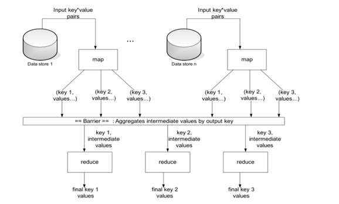

### Hadoop의 특성

- Distributed
- Scalable
- Fault-tolerant
- Open source

### Motivation for Hadoop

- 기존의 large-scale computation의 한계 극복
- 상대적으로 적은 양의 데이터를 많은 양의 복잡한 처리로 computation
- 컴퓨터 성능 향상으로 커버 가능 (더 빠른 processor와 많은 memory)
- 기존 방식을 벗어나 더 많은 컴퓨터를 사용해 분산 처리 시스템을 사용하기 시작

### Fault-tolerance

- Node가 fail한 경우, master node는 failure를 감지하고 작업을 다른 node에 할당
- Fail된 node를 재시작하는 경우, 자동적으로 시스템에 연결되어 새로운 task를 할당받음
- 특정 node의 성능이 낮으면 master node는 같은 task를 다른 node에 할당 (Speculative Execution)
- 시스템이 지속적으로 기능을 수행하게 해줌
- 데이터의 replication = 데이터의 손실 방지

### Hadoop의 문제점

- 3V
  - Volume
  - Velocity (속도)
  - Variety

### HDFS (Hadoop Distributed File System)

- 클러스터에 데이터를 저장하기 위해 사용
- 데이터는 block으로 분할되고, 클러스터의 여러 node에 분산되어 저장
- 기본적으로 한 block은 64MB 또는 128MB
- 각 block은 여러 개의 replication을 생성. 기본적으로 3개. 서로 다른 node에 저장됨
- 이를 통해 reliability와 availabilty 보장
- Google의 GFS를 기반으로 Java로 작성된 파일 시스템
- 기존 파일 시스템의 상위에서 동작
- Name node로 불리는 master node는 어떤 block들이 file을 구성하고 있고, 어느 위치에 저장되어 있는지에 대한 정보를 **meta data**로 관리
- 파일이 block의 크기보다 작은 경우에는 block 크기 전체를 사용하지 않음 (동적 할당)
- Block들은 Hadoop configuration에 설정된 디렉토리를 통해 저장됨
- Name node의 metadata를 사용하지 않으면, HDFS에 접근할 수 있는 방법이 없다.
- 클라이언트 app이 파일에 접근하는 경우, name node와 통신하여 정보를 받고 data node와 직접 통신. Name node는 bottleneck이 되지 않음
- `hadoop fs`라는 커맨드 라인을 사용하여 접근
- **Hue**라는 에코시스템으로 web 기반해서 browse, upload, download, file view가 가능
- Name node daemon은 반드시 항상 실행되고 있어야 함. (Name node가 중단되면 클러스터는 파일에 접근이 불가능)
- 로컬 디스트의 foo.txt 파일을 HDFS의 사용자 디렉토리로 복사
  - `$ hadoop fs -put foo.txt foo.txt`
- HDFS의 사용자 경로의 하위 디렉토리 목록을 출력
  - `$ hadoop fs -ls`
- HDFS의 root 경로의 하위 디렉토리 목록을 출력
  - `$ hadoop fs -ls /`
- HDFS의 경로 '/user/fred/bar.txt'의 내용을 출력
  - `$ hadoop fs -cat /user/fred/bar.txt`
- HDFS의 bar.txt 파일을 로컬 디렉토리로 복사
  - `$ hadoop fs -get /user/fred/bar.txt bar.txt`

### Hadoop의 구성요소

- Client : Name node를 통해 정보를 받고 이후 직접적으로 data node와 통신함
- Master node : 물리적으로 master node 역할 (Job tracker, Name node), slave node에 대한 정보와 실행을 할 task에 대한 관리를 담당
- Slave node : 물리적으로 slave node 역할 (Data node, Task node), 실제로 데이터를 분산해 가지고 있고 client에서 요청이 오면 데이터를 전달하는 역할 및 담당 task를 수행하는 역할
- Data analytics 관점
  - Job tracker : Node에 task를 할당. 모든 task를 모니터링, 실패할 경우 task를 재실행 하는 역할
  - Task tracker : Task는 map task와 reduce task로 나뉘질 수 있고, task가 위치한 HDFS의 데이터를 이용해 map, reduce를 수행
- Data storage 관점
  - Name node : HDFS의 파일 및 디렉토리에 대한 meta data 유지. Client로부터 데이터 위치 요청이 오면 전달, 당비 손성 시 secondary node로 대체
  - Data node : 데이터를 HDFS의 block 단위로 구성. Fault recovery를 위해 3 copy를 유지 (default)

### MR (MapReduce)

- Hadoop 클러스터의 데이터를 처리하기 위한 시스템
- 2개의 phase로 구성 : Map / Reduce
- Map과 Reduce 사이에는 shuffle과 sort라는 스테이지가 있음
- 기본적으로 하나의 HDFS block을 대상으로 수행
- 모든 map task가 종료되면 MapReduce 시스템은 intermediate 데이터를 reduce phase를 수행할 node로 분산하여 전송



- MapReduce job(full program)들을 job tracker에 의해 제어됨 (Master node)
- Client는 job을 job tracker에게 보내고 job tracker는 다른 node들에게 map과 reduce task를 할당
- Node들은 task tracker에 의해 실행
- Task는 데이터 조각을 통해 하나의 mapper 또는 reducer를 실행
- 동시에 실행되는 여러 mapper는 각각 입력 데이터의 일부를 처리하는 단계를 포함함

### Mapper

- Mapper는 Key/Value 쌍의 형태로 데이터를 읽는다.
- 0개 또는 그 이상의 Key/Value 쌍을 출력한다.
- 입력값의 key를 사용하기도 하지만 무시하기도 한다. 표준 패턴은 파일의 라인을 하나씩 읽는 것이다.
- Mapper가 무언가를 출력하는 경우, 출력 형태는 Key/Value 쌍이어야 한다.
- Combiner는 중간값들의 크기를 줄이기 위해 같은 mapper에서 나오는 반복되는 key값의 쌍들을 묶어준다.
  - Sum, count, max 등의 작업을 중간에 해준다.
  - Shuffle, sort가 일어나기 전에 해준다.

### Reducer

- Map 단계가 끝나면 중간 단계의 key 값을 기반으로 중간값(intermediate values)를 list 형태로 조합
- 중간 key와 그 value들의 list들은 key 순서대로 정렬되어 reducer로 보내짐 (shuffle, sort)
- Reducer의 output은 0이거나 Key/Value 형태이고 이 결과들은 HDFS에 저장된다.

### Hive

- Hadoop의 모든 작업을 Java로 직접 작성하는 것은 비효율적이다. 사용할 줄 아는 사람도 별로 없다.
- Higher-level 데이터 처리 언어 개발이 필요하고 이를 Facebook에서 만든 것이 Hive
- SQL과 유사한 HQL을 사용, 테이블은 HDFS에 flat file 형태로 저장됨
- Structured data를 HDFS에 저장하기 위한 data warehousing system
- Unstructured data를 어떻게든 table 형태로 보이게 하고, 이에 SQL 기반의 쿼리를 직접 사용 가능
- 장점
  - 대용량 데이터를 쉽게 처리할 수 있다.
  - SQL-based
  - 사용자가 정의한 확정된 인터페이스 제공
- 단점
  - 데이터를 추가하는 방법이 쉽지 않다.
  - HDFS 내부의 파일은 수정 불가 (immutable)
- MR 작업에서 compile 된다.
- Mata store를 include할 수 있고 쿼리 최적화 및 쿼리 편집에 유용한 스키마와 통계를 포함하고 있다.
- 데이터 포맷과 위치를 가지고 있는 meta store를 가지고 있다.
- 질의문(쿼리) 자체는 HDFS에 저장되어 있는 데이터에게 질의한다.

### Hive QL

- SQL의 일부분
- 전체 table을 덮어쓸 수 있음
- Cloudera에서 mySql 접속
  - `$ mysql --user=root --password=cloudera`
- 현재 서버에 있는 데이터베이스 띄우기 : `SHOW DATABASES;`
- 새 데이터베이스 만들기 : `CREATE DATABASES ___`
- 데이터베이스 사용 : `USE ___;`
- (선택 이후) 데이터베이스 내의 테이블 보기 : `SHOW TABLES;`
- 테이블 만들기 : `CREATE TABLE ___ (column_name TYPE(), ...);` (e.g. name varchar(20))
- 테이블 구조 보기 : `DESCRIBE ___;`
- 전체 테이블 삭제 : `DROP TABLE ___;`
- 테이블에 데이터 입력 : `INSERT INTO ___ values('', '', ...);`
- `SELECT` 무엇을 `FROM` 어느 테이블에서 `WHERE` 조건문 `ORDER BY` 정렬 (+`DESC`는 내림차순) `LIMIT` 몇 개만
- `WHERE`절에 부등호, `AND`, `OR` 사용 가능
- `SELECT`절에 ','로 여러 열 호출 가능

### Sqoop으로 table load 하기 (로컬 -> HDFS)

- MySQL에 로그온, 원하는 테이블까지 들어가서 스키마 확인, 내용 확인
- MySQL을 빠져나온 후 sqoop으로 데이터베이스 목록 확인
  - `$ sqoop list-databases --connect jdbc:mysql://localhost --username root --password cloudera`
- retail_db 데이터베이스의 테이블 목록 확인
  - `$ sqoop list-tables --connect jdbc:mysql://localhost/retail_db --username root --password cloudera`
- 로컬 디렉토리의 customers 테이블을 HDFS로 가져오기
  - `$ sqoop import --connect jdbc:mysql://localhost/retail_db --table customers --fields-terminated-by '\t' --username root --password cloudera` (default로 HDFS의 home path에 지정해준 table 이름으로 import함)
- `hadoop fs`로 정상적으로 import 되었는지 확인

### Hive의 databases와 tables 접근 방법

- 직접적인 HiveQL 실행
  - `$ hive -e 'SELECT * FROM users'`
- `$ hive`를 통해 hive에 접속 후 커맨드 입력 (`hive>`)
- Database에서 지정한 table을 포함하고 있는 것은?
  - `hive> SHOW TABLES IN ___;`
- 세부 정보는 `DESCRIBE`, 더 세부적인 정보는 `DESCRIBE FORMATTED`
- 새로운 데이터베이스 생성 : `CREATE DATABASE ___;`
- 기존의 데이터베이스가 있는지 체크하면서 생성
  - `hive> CREATE DATABASE IF NOT EXISTS ___;`
- Table 생성을 위한 기본 syntax

```SQL
CREATE TABLE table_name (column_name DATATYPE, ...)
ROW FORMAT DELIMITED
FIELDS TERMINATED BY char
STORED AS {TEXTFILE | SEQUENCEFILE | RCFILE}
```

### Hive로 table 가져오기

- HDFS를 거쳐 가져올 때는, Hive에 database, table을 같은 스키마로 만들고 `hive> LOAD DATA INPATH 'HDFS_path' INTO TABLE Hive_path`
- HDFS를 거치지 않을 때는 hive에 table 생성 후 sqoop으로 바로 올림 (HDFS에 같은 name의 table이 있다면 fail)
  - `$ sqoop import --connect jdbc:mysql://localhost/retail_db --username root --password cloudera --table categories --hive-database hive_retail_db --hive-import`

