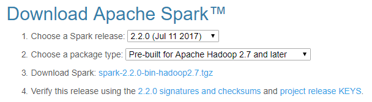

### PPT

- https://spark.apache.org/downloads.html에서 버전에 맞게 다운로드 합니다.
  - 버전을 선택하고 밑에 '3. Download Spark:' 옆의 파일명을 클릭하면 다운이 시작됩니다.



- https://medium.com/@GalarnykMichael/install-spark-on-windows-pyspark-4498a5d8d66c
  - 5번 항목부터 하시면 됩니다. 꼭 cmd창에서 쓰여 있는 명령어를 치지 않고 GUI로 (마우스로) 해도 됩니다.
  - 5번 : 다운받은 파일을 압축 해제할 곳으로 옮깁니다.
    - C:\opt\spark : 저 경로에 폴더를 만들고 그 폴더 안에 다운 받은 파일을 넣습니다.
  - 6번 : 현재 폴더에 그냥 압축 해제합니다.
  - 7번 : `winutils.exe`파일을 'spark-2.2.0-bin-hadoop2.7\bin' 폴더에 넣습니다. (저 파일은 강의 자료에 있음)
  - 8번은 일단 넘어갑니다.
  - 9번 : 
    - 시작 화면에서 `환경 변수`를 검색합니다. `계정의 환경 변수 편집` 클릭
- cmd에서 `pyspark --master local[2]`
  - 그러면 jupyter notebook이 열립니다. (`jupyter notebook`으로 열었을 때랑 겉보기엔 똑같음)
  - `sc = SparkContext.getOrCreate()`치고 그 cell만 run하면 이상없이 잘 돌아갑니다. (이게 다름)
- `import numpy as np` 한 줄만 일단 치고 run해봅니다.
  - numpy가 없대!
    - cmd 새로 열고 `pip install numpy`
  - 아무것도 안뜨고 잘 돌아갔으면 이후 내용 다 치고 run

---

### PDF

```
from pyspark import SparkConf, SparkContext
conf = (SparkConf()
       .setMaster("local")
       .setAppName("My app")
       .set("spark.executor.memory", "1g"))
sc = SparkContext(conf = conf)
```

- 해봅니다.
- cmd에서 `pyspark --master local[2]`로 열었을 경우 마지막 줄에서 에러가 뜰겁니다.
  - 그럼 마지막 줄만 빼세요
- `type(sc)`하면 'pyspark.context.SparkContext'라고 합니다. 축하해요. 잘 되고 있는 겁니다.
- `sc.__dict__`는 그냥 재미로 해보세요.

